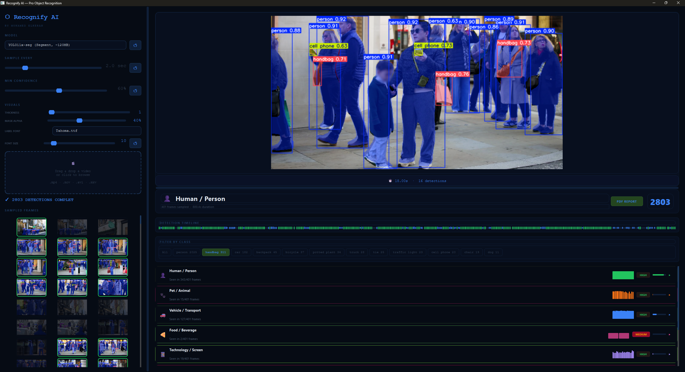

# Recognify AI: Advanced Object Recognition & Analytics Suite
**Developed by Mohamed Elkeran | © 2026**

**Recognify AI** is a professional-grade, high-performance industrial inspection and computer vision suite built with **PyQt6**, **OpenCV**, and **Ultralytics**. It features a state-of-the-art inference pipeline that integrates real-time object detection and instance segmentation with custom visual branding and deep analytical reporting!



---

## 🚀 Key Features

### 🧠 High-Performance Inference Engine
Recognify AI leverages the industry-leading Ultralytics engine to provide sub-millisecond object detection and segmentation.
- **Universal Model Support**: Native integration for **YOLOv8, YOLOv10, YOLOv11, and RT-DETR**.
- **Instance Segmentation**: Renders ultra-precise pixel-level masks for complex object boundary analysis.
- **Hardware Agnostic Acceleration**: Proactively discovers CUDA/GPU environments with a robust, thread-safe fallback to high-speed CPU inference.

### 🎨 State-of-the-Art Visual Customization
Take full control over the inspection overlay aesthetics in real-time. Changes apply instantly without re-processing.
- **Dynamic Bounding Boxes**: Adjust line thickness (1-10px) to match industrial display requirements.
- **Alpha-Chroma Masking**: Fluidly control the transparency (0-100%) of segmentation masks for perfect visual balance.
- **Premium Typography Engine**: Choose from a library of professional fonts and adjust label sizing (5-50pt) for maximum readability.

### 📊 Master Technical Dossier (PDF)
Generate comprehensive, audit-ready PDF reports with a single click. Every report is a professional analytical document.
- **Visual Evidence Grid**: An automated appendix featuring a high-density repository of unique recognition thumbnails.
- **Graphical Analytics Matrix**: Includes **Temporal Recognition Timelines**, **Frequency Bar Charts**, and **Reliability Donut Charts**.
- **Audit-Ready Data**: Detailed category tables featuring instance counts, average confidence, and peak reliability ratings.

### ⚡ Industrial Pipeline UX
- **DropZone Architecture**: A unified drag-and-drop interface for high-speed multi-media ingestion (Images & Videos).
- **Hero Frame Viewer**: High-fidelity viewport with sub-pixel zoom-to-cursor and double-click-to-fit logic.
- **Tactical Timeline**: Interactive frame-by-frame navigation through detection events.

---

## 📦 Installation
```bash
git clone https://github.com/melkeran/Recognify-AI.git
cd Recognify-AI
pip install -r requirements.txt
python src/main.py
```

## 🛠 Power User Shortcuts
- **Drag & Drop**: Ingest media from anywhere on your system into the central pipeline.
- **Scroll Wheel**: Deep zoom into detection regions rooted at your current cursor position.
- **Double Click (Viewer)**: Instantly reset the viewport to 'Unified Fit' bounds.
- **Refresh (↺)**: Re-render the current session instantly with new visual/font settings.
- **PDF Export**: Generate a multi-page technical dossier with embedded graphics and visual evidence.

---

## ⚖️ License
Distributed meticulously under the **MIT License**. See [LICENSE](LICENSE) for more legal information.  
Copyright (c) 2026 Mohamed Elkeran
